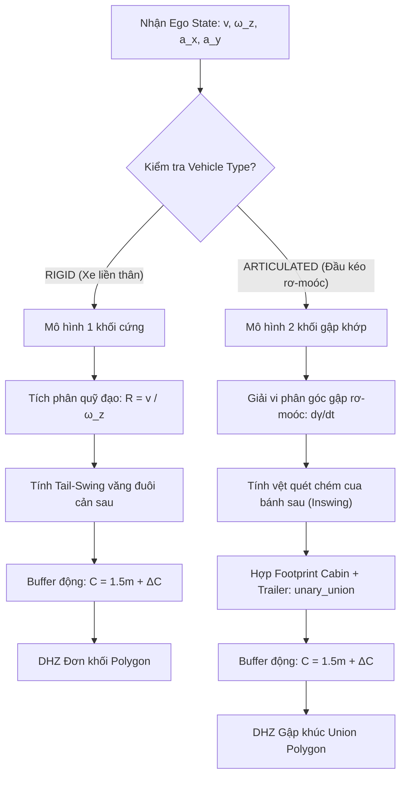

# 📘 TÀI LIỆU KỸ THUẬT: CƠ SỞ ĐỘNG HỌC, THÔNG SỐ XE VÀ MA TRẬN ĐẠI LƯỢNG DHZ & BSRI

> **Dự án**: BlindGuard AI — Hệ thống AI Cảnh Báo & Đánh Giá Rủi Ro Điểm Mù Cho Phương Tiện Cỡ Lớn  
> **Áp dụng cho**: Xe Tải Liền Thân (Rigid Truck) & Xe Đầu Kéo Sơ-mi Rơ-moóc (Articulated Tractor-Semitrailer)  
> **Cập nhật**: Tháng 09/2026

---

## MỤC LỤC CHI TIẾT
1. [Phân Biệt Cấu Hình & Cách Đo Xe Thực Tế (Sổ Đăng Kiểm & Thước Dây)](#1-phân-biệt-cấu-hình--cách-đo-xe-thực-tế)
2. [Tại Sao Gốc VCS Phải Đặt Tại Tâm Trục Sau? Xe Liền Thân Có $L_{\text{trail}} = 0$ Không?](#2-tại-sao-gốc-vcs-ở-tâm-trục-sau)
3. [Vận Tốc Xe Chủ Luôn Thẳng Trục X, Làm Sao Hệ Thống Biết Xe Đang Rẽ?](#3-làm-sao-biết-xe-đang-rẽ-khi-vecto-luôn-dọc-trục-x)
4. [Chiều Dài Toàn Xe Trong Đăng Kiểm Và Cách Xác Định Cản Trước / Cản Sau](#4-xác-định-chiều-dài-toàn-xe-và-phần-nhô)
5. [Hai Thuật Toán Tính DHZ Cho 2 Loại Thân Xe Khác Nhau](#5-hai-thuật-toán-tính-dhz-cho-2-loại-xe)
6. [Ma Trận Tra Cứu Toàn Diện Các Đại Lượng Input / Output (DHZ & BSRI)](#6-ma-trận-tra-cứu-đại-lượng-input--output)

---

## 1. PHÂN BIỆT CẤU HÌNH & CÁCH ĐO XE THỰC TẾ

### 1.1. So sánh sự khác nhau về bản chất kết cấu

| Đặc tính | Xe Tải Liền Thân (`RIGID`) | Xe Đầu Kéo Sơ-mi Rơ-moóc (`ARTICULATED`) |
| :--- | :--- | :--- |
| **Kiểu phương tiện** | Xe tải thùng, xe ben, xe bồn, xe chở rác | Đầu kéo (Tractor) kéo theo Sơ-mi rơ-moóc (Semi-trailer) |
| **Số khối cứng (Rigid Bodies)** | **1 khối duy nhất** liền từ đầu cabin đến đuôi | **2 khối độc lập** liên kết qua khớp mâm kéo (Fifth-wheel Kingpin) |
| **Khớp xoay (Hitch)** | **Không có** (Góc gập $\gamma \equiv 0$) | **Có khớp xoay** xoay quanh chốt mâm kéo (Góc gập $\gamma \ne 0$) |
| **Sổ Đăng Kiểm** | **1 Sổ đăng kiểm duy nhất** (Ô tô tải) | **2 Sổ đăng kiểm riêng biệt**: 1 Sổ Ô tô đầu kéo + 1 Sổ Sơ-mi rơ-moóc |
| **Hiện tượng khi rẽ** | Bánh sau chém cua nhẹ + **Văng đuôi (Tail swing)** | Thùng rơ-moóc **chém cua cực mạnh (Off-tracking/Inswing)** |

---

### 1.2. Hướng dẫn đo đạc và lấy thông số từ Sổ Đăng Kiểm & Thước Dây

```text
A. XE LIỀN THÂN (RIGID TRUCK):
   |<- L_fo ->| <----------- Wheelbase (L_wb) -----------> | <---- L_ro ----> |
   +----------+============================================+------------------+
   |  CABIN   |                 THÙNG HÀNG                 |                  |
   +----------+============================================+------------------+
              O (Trục trước lái)                           O (GỐC VCS: Trục sau)

B. XE ĐẦU KÉO RƠ-MOÓC (ARTICULATED):
   |< L_f_cab >| <--- L_f (Đầu kéo) ---> |
   +-----------+=========================+
   |   CABIN   |    KHUNG GẦM ĐẦU KÉO    | 
   +-----------+=========================+
               O                         O (GỐC VCS)
                                         * Hitch (Kingpin)
                                         \
                                          \ <------------- L_trail -------------> |
                                           +======================================+
                                           |          THÙNG SƠ-MI RƠ-MOÓC         |
                                           +======================================+
                                                                                  O (Trục Trailer)
```

#### Bảng thông số cần nhập và nguồn lấy:

| Tên biến trong Code | Ý nghĩa hình học | Lấy từ Sổ Đăng Kiểm | Cách đo thực tế bằng Thước Dây |
| :--- | :--- | :--- | :--- |
| **1. Đối với Xe Liền Thân (`RIGID`):** | | | |
| `rigid_wheelbase` ($L_{wb}$) | Khoảng cách từ tâm trục trước tới tâm trục sau | **Mục: "Chiều dài cơ sở"** (mm $\to$ m) | Kéo thước từ tâm trục bánh trước đến tâm trục bánh sau. (Nếu 2 cầu sau: đo đến điểm chính giữa 2 trục sau). |
| `rigid_front_length` | Từ tâm trục sau đến cản trước (mũi xe) | Không ghi trực tiếp | Đo từ tâm trục sau $\to$ mũi cản trước. Hoặc tính: $L_{wb} + L_{fo}$. |
| `rigid_rear_length` ($L_{ro}$) | Từ tâm trục sau đến mép cản sau cùng | Không ghi trực tiếp | Kéo thước từ tâm trục sau đến điểm nhô ra xa nhất của cản sau xe. |
| `rigid_width` | Chiều rộng thùng xe | **Mục: "Kích thước bao" (Số thứ 2: Rộng)** | Đo mép ngoài lốp bên trái sang mép ngoài lốp bên phải (hoặc độ rộng phủ bì của thùng xe). |
| **2. Đối với Xe Đầu Kéo (`ARTICULATED`):** | | | |
| `wheelbase_tractor` ($L_f$) | Chiều dài cơ sở đầu kéo | **Sổ đầu kéo $\to$ "Chiều dài cơ sở"** | Đo từ tâm bánh trước đầu kéo đến tâm cụm cầu sau đầu kéo. |
| `cab_width` | Chiều rộng cabin đầu kéo | **Sổ đầu kéo $\to$ Kích thước bao (Rộng)** | Đo mép gương chiếu hậu gập hoặc mép ngoài vè bánh xe đầu kéo. |
| `trailer_length` ($L_{\text{trail}}$) | Chiều dài thùng rơ-moóc | **Sổ rơ-moóc $\to$ "Chiều dài bao"** | Đo từ mép trước của thùng rơ-moóc đến mép cản sau của rơ-moóc. |
| `trailer_width` | Chiều rộng thùng rơ-moóc | **Sổ rơ-moóc $\to$ Kích thước bao (Rộng)** | Chiều rộng phủ bì sàn xe/thùng rơ-moóc (thường là $2.5\text{m}$). |
| `trailer_kingpin_to_axle` | Từ chốt kéo đến tâm cụm trục rơ-moóc | **Sổ rơ-moóc $\to$ "Khoảng cách trục"** | Đo từ tâm mâm xoay (Kingpin) đến tâm cụm trục bánh sau rơ-moóc. |

---

## 2. TẠI SAO GỐC VCS ĐẶT TẠI TÂM TRỤC SAU ĐẦU KÉO?

Hệ tọa độ xe (Vehicle Coordinate System - VCS) sử dụng **chiều dương các trục theo chuẩn ISO 8855** ($X$ hướng tới, $Y$ hướng sang trái, $Z$ hướng lên trời theo quy tắc bàn tay phải), nhưng **gốc tọa độ $(0, 0, 0)$ được đặt tại tâm trục sau** theo **Mô hình động học xe đạp Ackermann (Kinematic Bicycle Model / SAE J670)** vì các lý do cơ học chuẩn xác sau:

> [!NOTE]
> **Lưu ý học thuật quan trọng khi báo cáo**: Chuẩn ISO 8855 nguyên bản mặc định đặt gốc tọa độ tại **Trọng tâm xe (Center of Gravity - CoG)**. Tuy nhiên, trong động học điều khiển và hệ thống ADAS/Robotics, trọng tâm CoG thay đổi liên tục theo tải trọng hàng hóa (xe không tải vs xe chở 40 tấn). Do đó, việc cố định gốc tại **Tâm trục sau (Rear Axle Center)** là chuẩn mực của mô hình động học Ackermann để đảm bảo tính bất biến hình học.

### 2.1. Bản chất cơ học: Tâm quay tức thời (Instantaneous Center of Rotation - ICR)
1. **Bánh sau không có góc bẻ lái**: Các bánh sau cố định song song với trục dọc xe tải. Khi xe quay vòng (không trượt lốp), đường pháp tuyến của các bánh sau luôn nằm trên một đường thẳng kéo dài từ trục sau. Tâm quay tức thời (ICR) của toàn bộ xe luôn nằm trên đường kéo dài của trục này.
2. **Triệt tiêu vận tốc ngang tại gốc tọa độ ($v_y = 0$)**:
   * Nếu đặt gốc tại **mũi cabin (cản trước)**: Vì bánh trước bẻ lái đổi hướng, mũi xe vừa tiến vừa bị quét ngang, vận tốc tại mũi xe có cả $v_x$ và $v_y$ rất phức tạp, phụ thuộc vào góc đánh lái vô lăng.
   * Khi đặt gốc tại **tâm trục sau đầu kéo**: Vận tốc tức thời của xe chỉ thuần túy có thành phần tiến/lùi $v_x = v_{\text{ego}}$, còn vận tốc trượt ngang tại trục sau trong điều kiện bám đường thông thường bằng $0$ ($v_y \equiv 0$). Mọi chuyển động quay đều chỉ là vận tốc góc $\omega_z$ thuần túy xoay quanh gốc này!
3. **Mối liên hệ giữa 2 khối của xe đầu kéo**:
   * Mâm kéo Kingpin nằm ngay sát trên cầu sau ($X_{\text{hitch}} \approx 0.3\text{m}, Y = 0$).
   * Việc đặt gốc tại tâm trục sau đầu kéo cho phép biến đổi tọa độ sang thùng rơ-moóc cực kỳ đơn giản và chính xác $100\%$ chỉ bằng một phép quay quanh điểm chốt mâm kéo theo góc gập $\gamma$, không làm mất tính chính xác dù xe có 2 khối riêng biệt!

### 2.2. Xe liền thân không có rơ-moóc thì $L_{\text{trail}} = 0$ hả? Có ảnh hưởng gì không?

> [!CAUTION]
> **TUYỆT ĐỐI KHÔNG ĐƯỢC GÁN $L_{\text{trail}} = 0$ VÀO CÔNG THỨC XE ĐẦU KÉO!**

1. **Lý do toán học**:
   Trong phương trình vi phân động học rơ-moóc (Leng & Minor):
   $$\dot{\gamma} = -\frac{v_{\text{ego}}}{L_{\text{trail}}} \sin \gamma - \omega_z$$
   Nếu gán $L_{\text{trail}} = 0$, mẫu số bằng $0$ $\implies$ **Lỗi chia cho 0 (`ZeroDivisionError`)** hoặc làm góc gập $\gamma$ nổ tung ra vô cực!
2. **Giải pháp chuẩn của hệ thống**:
   Hệ thống BlindGuard AI sử dụng cờ phân loại kiểu thân xe (`VehicleType`):
   * Khi `vehicle_type = "ARTICULATED"`: Hệ thống chạy mô hình 2 khối gập khúc, dùng $L_{\text{trail}}$, $L_f$, góc gập $\gamma$.
   * Khi `vehicle_type = "RIGID"`: Hệ thống **bỏ qua hoàn toàn** các biến liên quan đến rơ-moóc (`L_trail`, `gamma`), chỉ dựng đúng 1 đa giác xe tải đơn khối với chiều dài từ cản trước đến cản sau.

---

## 3. LÀM SAO BIẾT XE ĐANG RẼ KHI VECTO VẬN TỐC LUÔN DỌC TRỤC X?

Nhiều kỹ sư thắc mắc: *"Nếu trong hệ VCS gắn chặt với thân xe, vector vận tốc xe chủ luôn là $\vec{v}_{\text{ego}} = [v_{\text{ego}}, 0]^T$, vậy làm sao toán học biết được xe đang quẹo phải hay quẹo trái?"*

### Câu trả lời: Hệ tọa độ VCS là Hệ quy chiếu phi quán tính đang QUAY (Rotating Non-Inertial Reference Frame)!

Chuyển động của xe tải không chỉ có **vận tốc tịnh tiến $v_{\text{ego}}$**, mà còn có **vận tốc góc quay (Yaw Rate $\omega_z$)** đo trực tiếp từ con quay hồi chuyển (Gyroscope) của IMU:

```text
              Y (Trái)
              ^
              |
              |       X (Tiến)
              +------> 
             / 
            /  ω_z (Quay ngược chiều kim đồng hồ: RẼ TRÁI > 0)
           v   ω_z (Quay cùng chiều kim đồng hồ: RẼ PHẢI < 0)
```

1. **Bán kính cong quỹ đạo tức thời ($R$)**:
   Khi tài xế đánh lái vào cua, xe quay với vận tốc góc $\omega_z$ (rad/s). Bán kính quay vòng của xe được tính ngay lập tức:
   $$R = \frac{v_{\text{ego}}}{\omega_z}$$
   * Nếu $\omega_z < -0.03\text{ rad/s}$: $R$ âm $\implies$ Xe đang bẻ lái ôm cua sang **PHẢI**.
   * Nếu $\omega_z > +0.03\text{ rad/s}$: $R$ dương $\implies$ Xe đang bẻ lái ôm cua sang **TRÁI**.
2. **Dự đoán vị trí trong tương lai ($t + \Delta t$) để dựng DHZ**:
   Trong khoảng thời gian dự đoán $\Delta t = 0.5\text{s}$, góc xoay thân xe thay đổi:
   $$\Delta \theta = \omega_z \cdot \Delta t$$
   Độ dời tọa độ của tâm xe trong tương lai:
   $$\Delta X = \frac{v_{\text{ego}}}{\omega_z} \sin(\Delta \theta) \approx v_{\text{ego}} \Delta t$$
   $$\Delta Y = \frac{v_{\text{ego}}}{\omega_z} \big(1 - \cos(\Delta \theta)\big) \approx \frac{1}{2} v_{\text{ego}} \omega_z (\Delta t)^2$$
   Nhìn vào $\Delta Y$: Khi rẽ phải ($\omega_z < 0$), $\Delta Y < 0$, vệt quét tương lai của thân xe **bị uốn cong lệch hẳn sang bên phải**!
3. **Vận tốc biểu kiến của vật cản do xe quay**:
   Một vật thể đứng yên trên mặt đất có vector vị trí $\vec{r} = [X, Y]^T$. Khi xe tự quay quanh mình với vận tốc góc $\vec{\omega} = [0, 0, \omega_z]^T$, vận tốc tương đối đo được trên camera bị cộng thêm thành phần chuyển động quay:
   $$\vec{v}_{\text{rot}} = - \vec{\omega} \times \vec{r} = \begin{bmatrix} \omega_z \cdot Y \\ -\omega_z \cdot X \end{bmatrix}$$
   Điều này khiến vật cản ở sườn phải ($Y < 0$) khi xe rẽ phải ($\omega_z < 0$) có xu hướng lao vọt vào tâm xe theo phương ngang!

---

## 4. XÁC ĐỊNH CHIỀU DÀI TOÀN XE VÀ PHẦN NHÔ

Trong Sổ Đăng Kiểm xe tải tại Việt Nam:
* **"Kích thước bao"**: Ghi $L_{\text{total}} \times W_{\text{total}} \times H_{\text{total}}$ (Ví dụ: $9800 \times 2500 \times 3600\text{ mm}$).
* **"Chiều dài cơ sở"**: Ghi $L_{wb}$ (Ví dụ: $5800\text{ mm}$).

Sổ đăng kiểm **không ghi tách rời** khoảng cách từ trục trước đến cản trước (Front Overhang) và từ trục sau đến cản sau (Rear Overhang).

### 4.1. Cách tính và đo bù:
Tổng chiều dài xe được tạo thành từ 3 đoạn:
$$L_{\text{total}} = L_{\text{fo}} (\text{Nhô trước}) + L_{wb} (\text{Cơ sở}) + L_{\text{ro}} (\text{Nhô sau})$$

1. **Phần nhô cản trước ($L_{\text{fo}}$)**: Đối với xe tải cabin lật tiêu chuẩn (Isuzu, Hino, Hyundai, Dongfeng), cản trước chỉ nhô ra trước trục bánh trước từ **$1.1\text{m} - 1.4\text{m}$**. Chỉ cần dùng thước dây đo nhanh từ mép trục trước ra cản trước.
2. **Phần nhô cản sau ($L_{\text{ro}}$)**: Được tính suy ra tự động hoặc đo thước dây:
   $$L_{\text{ro}} = L_{\text{total}} - L_{wb} - L_{\text{fo}}$$
   *Ví dụ*: Xe dài $9.8\text{m}$, cơ sở $5.8\text{m}$, mũi nhô $1.2\text{m} \implies$ Đuôi nhô sau cản: $9.8 - 5.8 - 1.2 = \mathbf{2.8\text{m}}$.

### 4.2. Thiếu thông số này có ảnh hưởng gì không?
* **Rất nguy hiểm nếu bỏ qua phần nhô sau ($L_{\text{ro}}$)**: 
  Khi xe tải thùng dài rẽ ngoặt ở ngã tư, phần đuôi sau cầu xe ($2.8\text{m}$) sẽ bị **văng ngược ra ngoài làn đường ngược lại (hiện tượng Tail-Swing)**. Nếu không khai báo $L_{\text{ro}}$, vùng nguy hiểm DHZ phía đuôi sẽ bị cụt, không cảnh báo được nguy cơ va quệt xe máy đi sát sau đuôi xe!

---

## 5. HAI THUẬT TOÁN TÍNH DHZ CHO 2 LOẠI XE

Hệ thống sử dụng **hai thuật toán hình học động khác nhau** tùy thuộc vào cấu trúc thân xe:



### 5.1. Thuật toán 1: Xe Tải Liền Thân (`RIGID`)
* **Dựng đa giác thân xe tại thời điểm $t = 0$**:
  * Tọa độ 4 góc: Cản trước $[+L_{\text{front}}, \pm W/2]$, Cản sau $[-L_{\text{rear}}, \pm W/2]$.
* **Dự đoán sau $\Delta t = 0.5\text{s}$**: Toàn bộ khối hình chữ nhật tịnh tiến theo cung tròn bán kính $R = v_{\text{ego}}/\omega_z$.
* **Văng đuôi (Tail Swing)**: Góc ngoài cùng phía sau văng rộng sang hướng đối diện góc lái:
  $$\Delta_{\text{tail}} = \sqrt{L_{\text{ro}}^2 + (W/2)^2} \cdot |\Delta \theta|$$
* **Phép nở đệm Minkowski (Buffer)**: Thêm khoảng đệm an toàn động $C = 1.5\text{m} + \Delta C$.

### 5.2. Thuật toán 2: Xe Đầu Kéo Sơ-mi Rơ-moóc (`ARTICULATED`)
* **Khối 1 (Cabin đầu kéo)**: Xoay theo góc lái $\theta(t)$ quanh tâm trục sau đầu kéo.
* **Khối 2 (Thùng rơ-moóc)**: Xoay quanh chốt mâm kéo (Kingpin) với góc gập $\gamma(t)$ được cập nhật bằng phương pháp Euler:
  $$\gamma(t + \Delta t) = \gamma(t) + \left( -\frac{v_{\text{ego}}}{L_{\text{k2a}}} \sin \gamma(t) - \omega_z(t) \right) \Delta t$$
* **Hiện tượng chém cua (Inswing)**: Cụm bánh sau rơ-moóc bị kéo lê lệch hẳn vào phía trong lòng cua một khoảng $\Delta_{\text{off-tracking}} \approx \frac{L_{\text{trail}}^2}{2R}$, tạo nên bụng rơ-moóc chém sát lề đường.
* **Phép hợp (Union)**: Sử dụng hàm `unary_union([polygon_cab, polygon_trailer])` để gộp 2 khối thành 1 vùng phủ mặt đất liên tục.

---

## 6. MA TRẬN TRA CỨU ĐẠI LƯỢNG INPUT / OUTPUT (DHZ & BSRI)

Dưới đây là bảng phân loại minh bạch **từng đại lượng**: đến từ đâu, nhập tay hay cảm biến đo, và được dùng ở bước nào.

### 6.1. Bảng các Đại lượng Đầu vào (Inputs)

| STT | Ký hiệu | Tên đại lượng | Đơn vị | Bản chất / Nguồn lấy | Dùng trong Phân hệ nào? |
| :---: | :--- | :--- | :---: | :--- | :--- |
| **I** | **CẤU HÌNH XE (Vehicle Static Config)** | | | | |
| 1 | `vehicle_type` | Kiểu loại xe | - | **Tự chọn khi cài đặt**: `"RIGID"` hoặc `"ARTICULATED"` | DHZ & BSRI |
| 2 | `rigid_wheelbase` | Chiều dài cơ sở xe liền thân | m | **Sổ Đăng Kiểm** (Mục "Chiều dài cơ sở") | DHZ (Rigid) |
| 3 | `rigid_front_length` | Từ trục sau đến cản trước mũi xe | m | **Đo thước dây** (Hoặc $L_{wb} + 1.2\text{m}$) | DHZ & BSRI |
| 4 | `rigid_rear_length` | Từ trục sau đến mép cản sau thùng | m | **Đo thước dây** | DHZ (Tail swing) |
| 5 | `rigid_width` | Chiều rộng thân xe liền thân | m | **Sổ Đăng Kiểm** (Mục "Kích thước bao - Rộng") | DHZ (Rigid) |
| 6 | `wheelbase_tractor` | Chiều dài cơ sở đầu kéo | m | **Sổ Đăng Kiểm Đầu Kéo** | DHZ (Articulated) |
| 7 | `cab_width` | Chiều rộng cabin đầu kéo | m | **Sổ Đăng Kiểm Đầu Kéo** | DHZ (Articulated) |
| 8 | `trailer_length` | Chiều dài thùng rơ-moóc | m | **Sổ Đăng Kiểm Rơ-moóc** | DHZ (Articulated) |
| 9 | `trailer_width` | Chiều rộng thùng rơ-moóc | m | **Sổ Đăng Kiểm Rơ-moóc** | DHZ (Articulated) |
| **II** | **CẢM BIẾN ĐỘNG HỌC XE CHỦ (Ego Sensors)** | | | | |
| 10 | $v_{\text{ego}}$ (`speed_mps`) | Vận tốc dọc xe chủ | m/s | **Cảm biến GPS/GNSS** (tốc độ mặt đất chuẩn) | DHZ, $v_{\text{closing}}$, TTC, $M_{\text{ego}}$ |
| 11 | $\omega_z$ (`yaw_rate_rad_s`) | Vận tốc góc quay trục Yaw | rad/s | **Con quay hồi chuyển IMU 6-DOF** (Trục Z) | DHZ quỹ đạo, $M_{\text{ego}}$, $\dot{\gamma}$ |
| 12 | $a_x$ (`accel_x_mps2`) | Gia tốc dọc thân xe | $\text{m/s}^2$ | **Gia tốc kế IMU 6-DOF** (Trục X) | $M_{\text{ego}}$ (Phát hiện phanh gấp) |
| 13 | $a_y$ (`accel_y_mps2`) | Gia tốc ngang thân xe | $\text{m/s}^2$ | **Gia tốc kế IMU 6-DOF** (Trục Y) | DHZ (Tính đệm động $\Delta C$) |
| 14 | `turn_signal` | Trạng thái rẽ (tùy chọn) | text | **Tự động suy luận từ $\omega_z$ IMU** (hoặc công tắc) | $M_{\text{ego}}$ khuếch đại rủi ro |
| **III**| **THỊ GIÁC AI BIÊN (Camera AI & Tracking)** | | | | |
| 15 | `bbox_xyxy` | Tọa độ Bounding Box trên ảnh | pixel | **YOLOv11n Detection** | Điểm chân tiếp đất $(u, v)$ |
| 16 | `class_name` | Tên loại chướng ngại vật | text | **YOLOv11n + Class Voting** (8 class VN) | Tra bảng hệ số ưu tiên $C_{\text{vru}}$ (Engineering Calibration) |
| 17 | `confidence` | Điểm tin cậy phát hiện | $0..1$ | **YOLOv11n Output** | Lọc rác & lưu vết |
| 18 | `track_id` | Mã định danh đối tượng | int | **ByteTrack MOT Engine** | Theo dõi liên tục theo thời gian |
| 19 | $X_{\text{vcs}}, Y_{\text{vcs}}$ | Tọa độ mặt đất hệ VCS | m | **Ma trận Homography $H_{3\times3}$** $\times [u, v, 1]^T$ | Khoảng cách $r$, $S_{\text{spatial}}$, $V_{\text{blind}}$ |
| 20 | $v_{x,\text{obs}}, v_{y,\text{obs}}$ | Vector vận tốc đối tượng | m/s | **Sai phân tọa độ VCS qua thời gian** $\Delta X / \Delta t$ | $v_{\text{closing}}$, TTC, $S_{\text{temporal}}$ |

---

### 6.2. Bảng các Đại lượng Trung gian & Đầu ra (Outputs)

| STT | Ký hiệu | Tên đại lượng | Đơn vị | Công thức xác định | Ý nghĩa quyết định an toàn |
| :---: | :--- | :--- | :---: | :--- | :--- |
| 1 | $\mathbf{DHZ}$ | Đa giác Vùng Nguy Hiểm Động | Polygon | $\text{Footprint}_{\text{swept}}(0.5\text{s}) \oplus (1.5\text{m} + \Delta C)$ | Ranh giới đỏ: Vật thể nào chạm vào đây đều coi là nguy hiểm |
| 2 | $d_{\text{dhz}}$ | Khoảng cách từ vật thể tới viền DHZ | m | Khoảng cách Euclid ngắn nhất tới mép Polygon | $d = 0$: Đã lọt vào trong lòng vùng xe quét qua |
| 3 | $S_{\text{spatial}}$ | Điểm rủi ro không gian | $0.0..1.0$ | $1.0$ nếu $d=0$; ngược lại: $\exp(-d / 1.8)$ | Đo độ gần gũi về mặt hình học tĩnh |
| 4 | $v_{\text{closing}}$ | Vận tốc tiếp cận hướng tâm | m/s | $-\frac{X_{\text{vcs}} \cdot vel_x + Y_{\text{vcs}} \cdot vel_y}{r}$ | Đo tốc độ hai xe đang lao về phía nhau (với $vel_x, vel_y$ là vận tốc tương đối từ Camera) |
| 5 | $TTC$ | Thời gian tới va chạm | giây (s) | $r / v_{\text{closing}}$ (khi $v_{\text{closing}} > 0.15$) | Còn bao nhiêu giây nữa đâm nhau (dưới giả định chuyển động tiếp diễn) |
| 6 | $S_{\text{temporal}}$ | Điểm rủi ro thời gian | $0.0..1.0$ | Hàm suy giảm theo ngưỡng phản xạ & trễ phanh khí nén ($1.2\text{s}, 3.5\text{s}$) | Đo mức độ khẩn cấp về mặt động học va chạm |
| 7 | $C_{\text{vru}}$ | Hệ số ưu tiên nhóm đối tượng tổn thương | $0.60..1.00$ | Nhóm VRU không khung vỏ: 1.00 (`person`, `motorcycle`, `bicycle`...); `car`: 0.70; `truck`/`bus`: 0.60 | Mức độ thiệt hại sinh mạng nếu xảy ra va chạm (Engineering Calibration) |
| 8 | $V_{\text{blind}}$ | Hệ số góc mù quang học | $0.85..1.25$ | Phân vùng theo $(X, Y)$ xoay theo $\gamma$ (Tham chiếu góc gương UNECE R46) | Phản ánh tầm quan sát trực tiếp của tài xế ($1.25$ bên phụ, $1.20$ mũi/đuôi, $1.10$ bên lái, $0.85$ thoáng) |
| 9 | $M_{\text{ego}}$ | Hệ số thao tác xe chủ | $0.70..1.60$ | Kiểm tra bẻ lái, lùi xe và phanh có định hướng | Tăng khi rẽ/lùi về phía vật cản ($1.35-1.40$), giảm khi phanh tránh vật trước ($0.85$), tăng khi phanh gấp có xe bám đuôi ($1.25$) |
| 10 | **`BSRI`** | **Chỉ số Rủi ro Điểm mù Tổng thể** | **$0.00..1.00$** | $\min\Big(1.0, (0.45 S_s + 0.55 S_t) \times C_{\text{vru}} \times V_{\text{blind}} \times M_{\text{ego}}\Big)$ | **Điểm số cốt lõi để kích hoạt cảnh báo** |
| 11 | **`RiskLevel`** | **Cấp độ cảnh báo chính thức** | Enum | SAFE ($<0.30$) / CAUTION / WARNING / CRITICAL ($\ge 0.80$) | **Lệnh gửi xuống ESP32 để hú còi/bật đèn LED** |
| 12 | `explanation` | Chuỗi giải thích ngữ cảnh XAI | text | Sinh tự động theo ngữ cảnh (Class, Khoảng cách, TTC) | Hiển thị lên màn hình Cabin HUD cho tài xế đọc |

